# FinCent - Use Case Diagram

> Status: Product diagram v0.1  
> Scope: Planned product behavior based on
> [0-fincent-product-foundation.md](./0-fincent-product-foundation.md) and
> [1-fincent-competitive-analysis.md](./1-fincent-competitive-analysis.md).  
> Purpose: Show FinCent's use cases, actors, system boundary, and major
> include/extend relationships before detailed PRD and system design.

## 1. Diagram Notes

- PlantUML is the source-of-truth diagram because Mermaid does not provide a
  native UML use case diagram syntax.
- The Mermaid diagram is a renderer-friendly fallback that approximates use
  cases with oval nodes.
- P0 represents MVP scope. P1 and P2 are included so product boundaries and
  future actors are visible, but they should not be treated as committed MVP
  delivery unless later PRDs confirm them.
- AI is modeled as a supporting actor only where FinCent may call an external
  model or AI service. Deterministic calculations remain inside FinCent.
- FinCent does not execute payments, transfers, investments, loans, or other
  real-money actions in the planned MVP.

## 2. Actors

| Actor | Type | Description |
| --- | --- | --- |
| Primary User | Primary | Target user who records transactions, checks financial position, manages budgets, evaluates purchases, and controls personal data. |
| AI Model Provider | Supporting system | External AI capability used for natural-language extraction, categorization suggestions, summaries, explanations, and question answering. |
| System Clock | Supporting trigger | Time-based trigger for recurring bills, contribution reminders, weekly reviews, monthly reports, and stale-data checks. |
| Notification Channel | Supporting system | Email, push, in-app, or other delivery channel used to send reminders, alerts, and periodic summaries. |
| Import Source | Supporting system | CSV files, receipt images, bank exports, bank connections, or wallet connections. CSV and receipt import are P1; direct bank or wallet sync is P2. |
| Household Member | Future primary actor | P2 actor for shared budgets, family accounts, permissions, and shared financial goals. |

## 3. Source-of-Truth PlantUML Diagram

```plantuml
@startuml
left to right direction

skinparam packageStyle rectangle
skinparam shadowing false
skinparam usecase {
  BackgroundColor #F8FAFC
  BorderColor #334155
  ArrowColor #334155
}
skinparam actor {
  BackgroundColor #FFFFFF
  BorderColor #334155
}

actor "Primary User\n(employed adult 22-35)" as User
actor "AI Model Provider\n(LLM / extraction / explanation)" as AI
actor "System Clock\n(schedule trigger)" as Clock
actor "Notification Channel\n(email / push / in-app)" as Notify
actor "Import Source\n(CSV / receipt / bank / wallet)" as Import
actor "Household Member\n(P2 shared finance)" as Household

rectangle "FinCent Personal Finance Decision System" {
  package "Identity and Profile" {
    usecase "UC-01.1 Register account" as UC_REG
    usecase "UC-01.2 Sign in / sign out" as UC_AUTH
    usecase "UC-01.3 Select currency" as UC_CUR
    usecase "UC-01.4 Configure financial cycle\n(calendar month or payday)" as UC_CYCLE
    usecase "UC-01.5 Review missing setup data" as UC_MISSING
  }

  package "Accounts, Balances, and Categories" {
    usecase "UC-01.6 Add financial account\n(cash, bank, wallet, credit)" as UC_ADD_ACCOUNT
    usecase "UC-01.7 Set opening balance" as UC_OPEN_BAL
    usecase "UC-02.5 Manage default categories" as UC_DEF_CAT
    usecase "UC-02.6 Create custom category" as UC_CUSTOM_CAT
    usecase "UC-09.5 Reconcile actual vs system balance" as UC_RECONCILE
  }

  package "Transaction Capture" {
    usecase "UC-02 Record transaction manually" as UC_MANUAL_TX
    usecase "UC-02.1 Select type\n(income / expense / transfer)" as UC_TX_TYPE
    usecase "UC-02.2 Select account, category,\ndate, note" as UC_TX_DETAILS
    usecase "UC-02.3 Save transaction" as UC_SAVE_TX
    usecase "UC-02.4 Edit / delete / duplicate\ntransaction" as UC_TX_CRUD
    usecase "UC-03 Record transaction\nusing natural language" as UC_NL_TX
    usecase "UC-03.1 Extract amount, time,\naccount, description, category" as UC_EXTRACT
    usecase "UC-03.2 Show AI draft preview" as UC_PREVIEW
    usecase "UC-03.3 Confirm or correct draft" as UC_CONFIRM
    usecase "UC-03.4 Ask for missing amount\nor account" as UC_ASK_MISSING
    usecase "UC-03.5 Learn from correction" as UC_LEARN
    usecase "P1 Import transactions\nfrom CSV or receipt image" as UC_IMPORT
    usecase "P2 Sync bank / wallet\ntransactions read-only" as UC_SYNC
  }

  package "Financial Overview and Metrics" {
    usecase "UC-04 View today's\nfinancial overview" as UC_OVERVIEW
    usecase "UC-04.1 View total balance\nby account" as UC_TOTAL_BAL
    usecase "UC-04.2 View income, expense,\nand net cash flow" as UC_CASH_FLOW
    usecase "UC-04.3 Calculate Safe-to-Spend" as UC_STS
    usecase "UC-04.4 Inspect Safe-to-Spend\nformula and inputs" as UC_STS_DETAILS
    usecase "UC-04.5 View projected\ncash-flow timeline" as UC_TIMELINE
    usecase "UC-04.6 View confidence and\ndata-quality warnings" as UC_DATA_WARN
    usecase "UC-04.7 View top 1-3 insights" as UC_TOP_INSIGHTS
  }

  package "Budgets" {
    usecase "UC-05 Manage category budget" as UC_BUDGET
    usecase "UC-05.1 Define spending limit" as UC_LIMIT
    usecase "UC-05.2 Track spent, remaining,\nand spending pace" as UC_BUDGET_TRACK
    usecase "UC-05.3 Forecast budget risk" as UC_BUDGET_RISK
    usecase "UC-05.4 Warn when likely\nto exceed budget" as UC_BUDGET_WARN
    usecase "UC-05.5 Recommend max spend\nfor rest of period" as UC_REMAIN_SPEND
    usecase "UC-05.6 Adjust budget" as UC_ADJUST_BUDGET
  }

  package "Recurring Income, Bills, and Commitments" {
    usecase "UC-06 Manage recurring\ntransactions and bills" as UC_RECUR
    usecase "UC-06.1 Create recurring income\nor expense schedule" as UC_RECUR_CREATE
    usecase "UC-06.2 Remind before due date" as UC_DUE_REMIND
    usecase "UC-06.3 Confirm occurrence\nwhen due" as UC_CONFIRM_DUE
    usecase "UC-06.4 Include projection in\ncash-flow calculation" as UC_RECUR_PROJECT
    usecase "UC-06.5 Warn projected\ninsufficient balance" as UC_INSUFF
    usecase "P0 weekly commitment\nconfirmation flow" as UC_WEEKLY_CONFIRM
  }

  package "Goals" {
    usecase "UC-07 Track financial goal" as UC_GOAL
    usecase "UC-07.1 Create target amount\nand deadline" as UC_GOAL_CREATE
    usecase "UC-07.2 Propose contribution\nfrom available cash flow" as UC_GOAL_PROPOSE
    usecase "UC-07.3 Choose contribution plan" as UC_GOAL_CHOOSE
    usecase "UC-07.4 Track goal progress" as UC_GOAL_TRACK
    usecase "UC-07.5 Send contribution reminder" as UC_GOAL_REMIND
    usecase "UC-07.6 Recalculate plan when\ncircumstances change" as UC_GOAL_RECALC
    usecase "UC-07.7 Offer recovery options\n(increase, extend, reduce)" as UC_GOAL_RECOVER
    usecase "P1 Manage multiple goals\nand priorities" as UC_MULTI_GOAL
  }

  package "Pre-Purchase Scenario Planning" {
    usecase "P0 Evaluate proposed purchase" as UC_PURCHASE
    usecase "P0 Enter scenario amount,\ndate, account, category" as UC_SCENARIO_INPUT
    usecase "P0 Compare buy now vs later\nvs reduced amount" as UC_SCENARIO_COMPARE
    usecase "P0 Calculate impact on\nSafe-to-Spend" as UC_IMPACT_STS
    usecase "P0 Calculate impact on bills,\nbudgets, cash flow" as UC_IMPACT_FLOW
    usecase "P0 Calculate goal-date impact" as UC_IMPACT_GOAL
    usecase "P0 Recommend safest action" as UC_RECOMMEND
    usecase "P0 Open evidence drawer" as UC_EVIDENCE
  }

  package "AI Assistant and Explainability" {
    usecase "UC-08 Ask AI assistant" as UC_AI_ASK
    usecase "UC-08.1 Answer with figures\nand assumptions" as UC_AI_DIRECT
    usecase "UC-08.2 Show relevant data\nand source transactions" as UC_AI_SOURCE
    usecase "UC-08.3 Recommend one action" as UC_AI_ACTION
    usecase "UC-08.4 Warn when data is\ninsufficient or estimated" as UC_AI_WARN
    usecase "UC-08.5 Explain trend, anomaly,\nbudget, goal, or scenario" as UC_AI_EXPLAIN
    usecase "Trust rule: keep deterministic\ncalculations as source of truth" as UC_DETERMINISTIC
  }

  package "Anomalies and Data Quality" {
    usecase "UC-09 Detect anomalies" as UC_ANOMALY
    usecase "UC-09.1 Detect unusually large expense" as UC_LARGE_EXP
    usecase "UC-09.2 Detect fast-growing category" as UC_FAST_CAT
    usecase "UC-09.3 Detect duplicate transaction" as UC_DUP_TX
    usecase "UC-09.4 Detect recurring bill\namount change" as UC_BILL_CHANGE
    usecase "UC-09.6 Flag stale or inconsistent data" as UC_STALE
    usecase "UC-09.7 Ask user to review issue" as UC_REVIEW_ISSUE
    usecase "UC-09.8 Correct transaction,\nbalance, or schedule" as UC_CORRECT
  }

  package "Reports, Reviews, and Notifications" {
    usecase "UC-10 Receive weekly or\nmonthly report" as UC_REPORT
    usecase "UC-10.1 Summarize income,\nexpenses, net cash flow" as UC_REPORT_SUM
    usecase "UC-10.2 Compare with\nprevious period" as UC_REPORT_COMPARE
    usecase "UC-10.3 Summarize budgets,\ngoals, anomalies" as UC_REPORT_STATUS
    usecase "UC-10.4 Show up to three\npriority actions" as UC_PRIORITY
    usecase "P1 Send multichannel\nnotifications" as UC_MULTI_NOTIFY
  }

  package "Personal Data, Privacy, and Auditability" {
    usecase "UC-11 Manage personal data" as UC_DATA
    usecase "UC-11.1 Export transactions" as UC_EXPORT
    usecase "UC-11.2 View and edit history" as UC_HISTORY
    usecase "UC-11.3 Control AI data usage" as UC_AI_CONTROL
    usecase "UC-11.4 Delete account and data" as UC_DELETE
    usecase "UC-11.5 View important\nchange history / audit log" as UC_AUDIT
    usecase "UC-11.6 Review data retention\nand transmission policy" as UC_POLICY
  }

  package "Future Shared Finance and Advanced Domains" {
    usecase "P2 Manage family account\nor shared budget" as UC_SHARED
    usecase "P2 Configure permissions" as UC_PERMISSIONS
    usecase "P2 Track advanced debt" as UC_DEBT
    usecase "P2 Track investment portfolio\nand asset values" as UC_INVEST
  }
}

User --> UC_REG
User --> UC_AUTH
User --> UC_CUR
User --> UC_CYCLE
User --> UC_ADD_ACCOUNT
User --> UC_MANUAL_TX
User --> UC_NL_TX
User --> UC_IMPORT
User --> UC_SYNC
User --> UC_OVERVIEW
User --> UC_BUDGET
User --> UC_RECUR
User --> UC_GOAL
User --> UC_PURCHASE
User --> UC_AI_ASK
User --> UC_REVIEW_ISSUE
User --> UC_REPORT
User --> UC_DATA
Household --> UC_SHARED

Clock --> UC_DUE_REMIND
Clock --> UC_GOAL_REMIND
Clock --> UC_WEEKLY_CONFIRM
Clock --> UC_REPORT
Clock --> UC_STALE

UC_DUE_REMIND --> Notify
UC_INSUFF --> Notify
UC_BUDGET_WARN --> Notify
UC_GOAL_REMIND --> Notify
UC_REPORT --> Notify
UC_MULTI_NOTIFY --> Notify

Import --> UC_IMPORT
Import --> UC_SYNC
AI --> UC_EXTRACT
AI --> UC_AI_DIRECT
AI --> UC_AI_EXPLAIN
AI --> UC_TOP_INSIGHTS

UC_ADD_ACCOUNT .> UC_OPEN_BAL : <<include>>
UC_ADD_ACCOUNT .> UC_RECONCILE : <<extend>>
UC_MISSING .> UC_CUR : <<extend>>
UC_MISSING .> UC_ADD_ACCOUNT : <<extend>>
UC_MISSING .> UC_RECUR_CREATE : <<extend>>
UC_MISSING .> UC_GOAL_CREATE : <<extend>>

UC_MANUAL_TX .> UC_TX_TYPE : <<include>>
UC_MANUAL_TX .> UC_TX_DETAILS : <<include>>
UC_MANUAL_TX .> UC_SAVE_TX : <<include>>
UC_MANUAL_TX .> UC_CUSTOM_CAT : <<extend>>
UC_SAVE_TX .> UC_TOTAL_BAL : <<include>>
UC_SAVE_TX .> UC_CASH_FLOW : <<include>>
UC_SAVE_TX .> UC_STS : <<include>>
UC_SAVE_TX .> UC_BUDGET_TRACK : <<include>>
UC_SAVE_TX .> UC_GOAL_TRACK : <<include>>
UC_TX_CRUD .> UC_SAVE_TX : <<include>>

UC_NL_TX .> UC_EXTRACT : <<include>>
UC_NL_TX .> UC_PREVIEW : <<include>>
UC_NL_TX .> UC_CONFIRM : <<include>>
UC_CONFIRM .> UC_SAVE_TX : <<include>>
UC_ASK_MISSING .> UC_CONFIRM : <<extend>>
UC_LEARN .> UC_CONFIRM : <<extend>>
UC_IMPORT .> UC_SAVE_TX : <<include>>
UC_SYNC .> UC_SAVE_TX : <<include>>

UC_OVERVIEW .> UC_TOTAL_BAL : <<include>>
UC_OVERVIEW .> UC_CASH_FLOW : <<include>>
UC_OVERVIEW .> UC_STS : <<include>>
UC_OVERVIEW .> UC_TIMELINE : <<include>>
UC_OVERVIEW .> UC_TOP_INSIGHTS : <<include>>
UC_STS .> UC_RECUR_PROJECT : <<include>>
UC_STS .> UC_GOAL_TRACK : <<include>>
UC_STS .> UC_STS_DETAILS : <<include>>
UC_DATA_WARN .> UC_STS : <<extend>>
UC_RECONCILE .> UC_DATA_WARN : <<extend>>

UC_BUDGET .> UC_LIMIT : <<include>>
UC_BUDGET .> UC_BUDGET_TRACK : <<include>>
UC_BUDGET .> UC_BUDGET_RISK : <<include>>
UC_BUDGET_WARN .> UC_BUDGET_RISK : <<extend>>
UC_REMAIN_SPEND .> UC_BUDGET_RISK : <<extend>>
UC_ADJUST_BUDGET .> UC_BUDGET : <<extend>>

UC_RECUR .> UC_RECUR_CREATE : <<include>>
UC_RECUR .> UC_RECUR_PROJECT : <<include>>
UC_RECUR .> UC_CONFIRM_DUE : <<include>>
UC_DUE_REMIND .> UC_RECUR : <<extend>>
UC_INSUFF .> UC_RECUR_PROJECT : <<extend>>
UC_WEEKLY_CONFIRM .> UC_RECUR : <<extend>>

UC_GOAL .> UC_GOAL_CREATE : <<include>>
UC_GOAL .> UC_GOAL_PROPOSE : <<include>>
UC_GOAL .> UC_GOAL_CHOOSE : <<include>>
UC_GOAL .> UC_GOAL_TRACK : <<include>>
UC_GOAL_PROPOSE .> UC_STS : <<include>>
UC_GOAL_REMIND .> UC_GOAL_TRACK : <<extend>>
UC_GOAL_RECALC .> UC_GOAL_TRACK : <<extend>>
UC_GOAL_RECOVER .> UC_GOAL_RECALC : <<extend>>
UC_MULTI_GOAL .> UC_GOAL : <<extend>>

UC_PURCHASE .> UC_SCENARIO_INPUT : <<include>>
UC_PURCHASE .> UC_SCENARIO_COMPARE : <<include>>
UC_PURCHASE .> UC_IMPACT_STS : <<include>>
UC_PURCHASE .> UC_IMPACT_FLOW : <<include>>
UC_PURCHASE .> UC_IMPACT_GOAL : <<include>>
UC_PURCHASE .> UC_RECOMMEND : <<include>>
UC_PURCHASE .> UC_EVIDENCE : <<include>>
UC_IMPACT_STS .> UC_STS : <<include>>
UC_IMPACT_FLOW .> UC_RECUR_PROJECT : <<include>>
UC_IMPACT_FLOW .> UC_BUDGET_RISK : <<include>>
UC_IMPACT_GOAL .> UC_GOAL_RECALC : <<include>>
UC_RECOMMEND .> UC_DATA_WARN : <<extend>>

UC_AI_ASK .> UC_DETERMINISTIC : <<include>>
UC_AI_ASK .> UC_AI_DIRECT : <<include>>
UC_AI_ASK .> UC_AI_SOURCE : <<include>>
UC_AI_ASK .> UC_AI_ACTION : <<include>>
UC_AI_WARN .> UC_AI_ASK : <<extend>>
UC_AI_EXPLAIN .> UC_AI_ASK : <<extend>>
UC_AI_SOURCE .> UC_EVIDENCE : <<include>>
UC_AI_SOURCE .> UC_HISTORY : <<include>>

UC_ANOMALY .> UC_LARGE_EXP : <<include>>
UC_ANOMALY .> UC_FAST_CAT : <<include>>
UC_ANOMALY .> UC_DUP_TX : <<include>>
UC_ANOMALY .> UC_BILL_CHANGE : <<include>>
UC_ANOMALY .> UC_STALE : <<include>>
UC_ANOMALY .> UC_REVIEW_ISSUE : <<include>>
UC_REVIEW_ISSUE .> UC_CORRECT : <<extend>>
UC_CORRECT .> UC_SAVE_TX : <<include>>
UC_CORRECT .> UC_RECUR_CREATE : <<include>>
UC_CORRECT .> UC_RECONCILE : <<include>>

UC_REPORT .> UC_REPORT_SUM : <<include>>
UC_REPORT .> UC_REPORT_COMPARE : <<include>>
UC_REPORT .> UC_REPORT_STATUS : <<include>>
UC_REPORT .> UC_PRIORITY : <<include>>
UC_REPORT_STATUS .> UC_ANOMALY : <<include>>
UC_PRIORITY .> UC_RECOMMEND : <<include>>
UC_MULTI_NOTIFY .> UC_REPORT : <<extend>>

UC_DATA .> UC_EXPORT : <<include>>
UC_DATA .> UC_HISTORY : <<include>>
UC_DATA .> UC_AI_CONTROL : <<include>>
UC_DATA .> UC_DELETE : <<include>>
UC_DATA .> UC_AUDIT : <<include>>
UC_DATA .> UC_POLICY : <<include>>
UC_AI_CONTROL .> UC_AI_ASK : <<extend>>

UC_SHARED .> UC_PERMISSIONS : <<include>>
UC_DEBT .> UC_STS : <<extend>>
UC_INVEST .> UC_TOTAL_BAL : <<extend>>

@enduml
```

## 4. Mermaid Fallback Diagram

```mermaid
flowchart LR
  user["Primary User"]
  ai["AI Model Provider"]
  clock["System Clock"]
  notify["Notification Channel"]
  import["Import Source"]
  household["Household Member (P2)"]

  subgraph fincent["FinCent Personal Finance Decision System"]
    direction LR

    subgraph identity["Identity and Profile"]
      reg(("UC-01.1 Register account"))
      auth(("UC-01.2 Sign in / sign out"))
      currency(("UC-01.3 Select currency"))
      cycle(("UC-01.4 Configure financial cycle"))
      missing(("UC-01.5 Review missing setup data"))
    end

    subgraph accounts["Accounts, Balances, and Categories"]
      addAccount(("UC-01.6 Add financial account"))
      openingBalance(("UC-01.7 Set opening balance"))
      defaultCategory(("UC-02.5 Manage default categories"))
      customCategory(("UC-02.6 Create custom category"))
      reconcile(("UC-09.5 Reconcile balance"))
    end

    subgraph transactions["Transaction Capture"]
      manualTx(("UC-02 Manual transaction"))
      txType(("UC-02.1 Select transaction type"))
      txDetails(("UC-02.2 Select details"))
      saveTx(("UC-02.3 Save transaction"))
      txCrud(("UC-02.4 Edit / delete / duplicate"))
      nlTx(("UC-03 Natural-language transaction"))
      extract(("UC-03.1 Extract fields"))
      preview(("UC-03.2 Show draft preview"))
      confirm(("UC-03.3 Confirm or correct"))
      askMissing(("UC-03.4 Ask for missing data"))
      learn(("UC-03.5 Learn from correction"))
      importTx(("P1 Import CSV / receipt"))
      syncTx(("P2 Sync bank / wallet"))
    end

    subgraph overview["Financial Overview and Metrics"]
      dashboard(("UC-04 Today's overview"))
      balance(("UC-04.1 Balance by account"))
      cashFlow(("UC-04.2 Cash flow"))
      sts(("UC-04.3 Safe-to-Spend"))
      stsDetails(("UC-04.4 Formula and inputs"))
      timeline(("UC-04.5 Cash-flow timeline"))
      dataWarn(("UC-04.6 Data warnings"))
      insights(("UC-04.7 Top insights"))
    end

    subgraph budgets["Budgets"]
      budget(("UC-05 Manage budget"))
      limit(("UC-05.1 Define limit"))
      budgetTrack(("UC-05.2 Track pace"))
      budgetRisk(("UC-05.3 Forecast risk"))
      budgetWarn(("UC-05.4 Budget warning"))
      remainingSpend(("UC-05.5 Recommend max spend"))
      adjustBudget(("UC-05.6 Adjust budget"))
    end

    subgraph recurring["Recurring Income, Bills, and Commitments"]
      recurringMain(("UC-06 Manage recurring items"))
      recurringCreate(("UC-06.1 Create schedule"))
      dueReminder(("UC-06.2 Due reminder"))
      confirmDue(("UC-06.3 Confirm occurrence"))
      recurringProjection(("UC-06.4 Project cash flow"))
      insufficient(("UC-06.5 Insufficient balance warning"))
      weeklyConfirm(("P0 Weekly commitment confirmation"))
    end

    subgraph goals["Goals"]
      goal(("UC-07 Track goal"))
      goalCreate(("UC-07.1 Create target"))
      goalPropose(("UC-07.2 Propose contribution"))
      goalChoose(("UC-07.3 Choose plan"))
      goalTrack(("UC-07.4 Track progress"))
      goalReminder(("UC-07.5 Contribution reminder"))
      goalRecalc(("UC-07.6 Recalculate plan"))
      goalRecover(("UC-07.7 Recovery options"))
      multiGoal(("P1 Multiple goals"))
    end

    subgraph scenario["Pre-Purchase Scenario Planning"]
      purchase(("P0 Evaluate proposed purchase"))
      scenarioInput(("P0 Enter scenario"))
      scenarioCompare(("P0 Compare options"))
      impactSts(("P0 Impact on Safe-to-Spend"))
      impactFlow(("P0 Impact on bills, budget, cash flow"))
      impactGoal(("P0 Impact on goal date"))
      recommend(("P0 Recommend safest action"))
      evidence(("P0 Evidence drawer"))
    end

    subgraph assistant["AI Assistant and Explainability"]
      askAi(("UC-08 Ask AI assistant"))
      directAnswer(("UC-08.1 Figures and assumptions"))
      sourceData(("UC-08.2 Source data"))
      aiAction(("UC-08.3 One action"))
      aiWarning(("UC-08.4 Insufficient-data warning"))
      explain(("UC-08.5 Explain trend or scenario"))
      deterministic(("Trust: deterministic source of truth"))
    end

    subgraph anomalies["Anomalies and Data Quality"]
      anomaly(("UC-09 Detect anomalies"))
      largeExpense(("UC-09.1 Large expense"))
      fastCategory(("UC-09.2 Fast-growing category"))
      duplicateTx(("UC-09.3 Duplicate transaction"))
      billChange(("UC-09.4 Bill amount change"))
      staleData(("UC-09.6 Stale or inconsistent data"))
      reviewIssue(("UC-09.7 Ask user to review"))
      correctData(("UC-09.8 Correct data"))
    end

    subgraph reports["Reports, Reviews, and Notifications"]
      report(("UC-10 Weekly / monthly report"))
      reportSum(("UC-10.1 Income, expense, net cash flow"))
      reportCompare(("UC-10.2 Compare previous period"))
      reportStatus(("UC-10.3 Budgets, goals, anomalies"))
      priority(("UC-10.4 Priority actions"))
      multiNotify(("P1 Multichannel notifications"))
    end

    subgraph privacy["Personal Data, Privacy, and Auditability"]
      data(("UC-11 Manage personal data"))
      exportData(("UC-11.1 Export transactions"))
      history(("UC-11.2 View and edit history"))
      aiControl(("UC-11.3 Control AI data usage"))
      deleteData(("UC-11.4 Delete account and data"))
      audit(("UC-11.5 Audit log"))
      policy(("UC-11.6 Retention and transmission policy"))
    end

    subgraph future["Future Shared Finance and Advanced Domains"]
      shared(("P2 Shared budget"))
      permissions(("P2 Permissions"))
      debt(("P2 Advanced debt"))
      invest(("P2 Investments"))
    end
  end

  user --> reg
  user --> auth
  user --> manualTx
  user --> nlTx
  user --> dashboard
  user --> budget
  user --> recurringMain
  user --> goal
  user --> purchase
  user --> askAi
  user --> report
  user --> data
  user --> importTx
  user --> syncTx
  household --> shared
  import --> importTx
  import --> syncTx
  ai --> extract
  ai --> directAnswer
  ai --> explain
  clock --> dueReminder
  clock --> goalReminder
  clock --> weeklyConfirm
  clock --> report
  clock --> staleData
  dueReminder --> notify
  insufficient --> notify
  budgetWarn --> notify
  goalReminder --> notify
  report --> notify

  addAccount -. include .-> openingBalance
  manualTx -. include .-> txType
  manualTx -. include .-> txDetails
  manualTx -. include .-> saveTx
  manualTx -. extend .-> customCategory
  txCrud -. include .-> saveTx
  nlTx -. include .-> extract
  nlTx -. include .-> preview
  nlTx -. include .-> confirm
  confirm -. include .-> saveTx
  askMissing -. extend .-> confirm
  learn -. extend .-> confirm
  importTx -. include .-> saveTx
  syncTx -. include .-> saveTx

  dashboard -. include .-> balance
  dashboard -. include .-> cashFlow
  dashboard -. include .-> sts
  dashboard -. include .-> timeline
  dashboard -. include .-> insights
  sts -. include .-> stsDetails
  sts -. include .-> recurringProjection
  sts -. include .-> goalTrack
  dataWarn -. extend .-> sts
  reconcile -. extend .-> dataWarn

  budget -. include .-> limit
  budget -. include .-> budgetTrack
  budget -. include .-> budgetRisk
  budgetWarn -. extend .-> budgetRisk
  remainingSpend -. extend .-> budgetRisk
  adjustBudget -. extend .-> budget

  recurringMain -. include .-> recurringCreate
  recurringMain -. include .-> recurringProjection
  recurringMain -. include .-> confirmDue
  dueReminder -. extend .-> recurringMain
  insufficient -. extend .-> recurringProjection
  weeklyConfirm -. extend .-> recurringMain

  goal -. include .-> goalCreate
  goal -. include .-> goalPropose
  goal -. include .-> goalChoose
  goal -. include .-> goalTrack
  goalPropose -. include .-> sts
  goalReminder -. extend .-> goalTrack
  goalRecalc -. extend .-> goalTrack
  goalRecover -. extend .-> goalRecalc
  multiGoal -. extend .-> goal

  purchase -. include .-> scenarioInput
  purchase -. include .-> scenarioCompare
  purchase -. include .-> impactSts
  purchase -. include .-> impactFlow
  purchase -. include .-> impactGoal
  purchase -. include .-> recommend
  purchase -. include .-> evidence
  impactSts -. include .-> sts
  impactFlow -. include .-> recurringProjection
  impactFlow -. include .-> budgetRisk
  impactGoal -. include .-> goalRecalc
  recommend -. extend .-> dataWarn

  askAi -. include .-> deterministic
  askAi -. include .-> directAnswer
  askAi -. include .-> sourceData
  askAi -. include .-> aiAction
  aiWarning -. extend .-> askAi
  explain -. extend .-> askAi
  sourceData -. include .-> evidence
  sourceData -. include .-> history

  anomaly -. include .-> largeExpense
  anomaly -. include .-> fastCategory
  anomaly -. include .-> duplicateTx
  anomaly -. include .-> billChange
  anomaly -. include .-> staleData
  anomaly -. include .-> reviewIssue
  reviewIssue -. extend .-> correctData
  correctData -. include .-> saveTx
  correctData -. include .-> recurringCreate
  correctData -. include .-> reconcile

  report -. include .-> reportSum
  report -. include .-> reportCompare
  report -. include .-> reportStatus
  report -. include .-> priority
  reportStatus -. include .-> anomaly
  priority -. include .-> recommend
  multiNotify -. extend .-> report

  data -. include .-> exportData
  data -. include .-> history
  data -. include .-> aiControl
  data -. include .-> deleteData
  data -. include .-> audit
  data -. include .-> policy
  aiControl -. extend .-> askAi
  shared -. include .-> permissions
  debt -. extend .-> sts
  invest -. extend .-> balance
```

## 5. Use Case Catalogue

| ID | Use case | Primary actor | Scope | Includes / key dependencies | Extension or exception behavior |
| --- | --- | --- | --- | --- | --- |
| UC-01 | Set up an initial financial profile | Primary User | P0 | Register, select currency, configure cycle, add accounts, enter opening balances, add income, bills, and one goal | Missing setup data triggers guided completion and incomplete-data warnings. |
| UC-01.1 | Register account | Primary User | P0 | User profile creation | Account deletion later depends on identity and ownership. |
| UC-01.2 | Sign in / sign out | Primary User | P0 | Authentication session | Future security PRD should define recovery, MFA, and device management. |
| UC-01.3 | Select currency | Primary User | P0 | Profile preferences | Multi-currency handling is deferred unless a later PRD moves it into MVP. |
| UC-01.4 | Configure financial cycle | Primary User | P0 | Calendar month or payday-based period | Safe-to-Spend and budget pacing depend on this period boundary. |
| UC-01.5 | Review missing setup data | Primary User | P0 | Data-quality checks | The system must avoid false certainty when balances, bills, income, or goal data are incomplete. |
| UC-01.6 | Add financial account | Primary User | P0 | Account type, display name, optional institution, opening balance | Credit and debt behavior needs a dedicated PRD before advanced handling. |
| UC-01.7 | Set opening balance | Primary User | P0 | Financial account | Reconciliation warnings may appear when actual balance diverges from system balance. |
| UC-02 | Record a transaction manually | Primary User | P0 | Type, amount, account, category, date, note, save transaction | Custom category creation extends this flow. |
| UC-02.1 | Select transaction type | Primary User | P0 | Income, expense, transfer | Transfer support should avoid double-counting income or expense totals. |
| UC-02.2 | Select transaction details | Primary User | P0 | Account, category, date, note | Defaults and recent values can reduce entry friction. |
| UC-02.3 | Save transaction | Primary User | P0 | Update balance, cash flow, Safe-to-Spend, budget pace, goal progress | Invalid amount, missing account, or missing category blocks save. |
| UC-02.4 | Edit, delete, or duplicate transaction | Primary User | P0 | Existing transaction | Changes should create audit history and recalculate affected metrics. |
| UC-02.5 | Manage default categories | Primary User | P0 | Category taxonomy | System categories should be available immediately after onboarding. |
| UC-02.6 | Create custom category | Primary User | P0 | Category name, type, optional budget grouping | Duplicate or ambiguous category names should be prevented or clarified. |
| UC-03 | Record a transaction using natural language | Primary User | P0 | AI extraction, preview, confirmation, save transaction | The AI draft must never be saved without user confirmation. |
| UC-03.1 | Extract amount, time, account, description, and category | AI Model Provider | P0 | Natural-language input and allowed user data subset | Missing amount or unknown account must trigger a clarification instead of guessing. |
| UC-03.2 | Show AI draft preview | Primary User | P0 | Extracted structured fields | Preview must clearly identify inferred fields and confidence. |
| UC-03.3 | Confirm or correct draft | Primary User | P0 | Draft transaction | Corrections feed future suggestions only under allowed data-use settings. |
| UC-03.4 | Ask for missing amount or account | Primary User | P0 | Clarification prompt | If the user does not answer, the draft remains unsaved. |
| UC-03.5 | Learn from correction | AI Model Provider | P0 | Confirmed correction and consent rules | Learning must respect AI data usage controls. |
| UC-04 | View today's financial overview | Primary User | P0 | Balances, cash flow, Safe-to-Spend, upcoming bills, budgets, goal, insights | Incomplete inputs show warnings and lower confidence. |
| UC-04.1 | View total balance by account | Primary User | P0 | Account balances | Stale account balances trigger reconciliation prompts. |
| UC-04.2 | View income, expenses, and net cash flow | Primary User | P0 | Transactions in current period | Transfer handling must not inflate totals. |
| UC-04.3 | Calculate Safe-to-Spend | Primary User | P0 | Current balance, remaining income, bills, essentials, goal contributions, buffer | Result is an estimate and must expose period, inclusions, exclusions, and confidence. |
| UC-04.4 | Inspect Safe-to-Spend formula and inputs | Primary User | P0 | Safe-to-Spend calculation | User can inspect which accounts, bills, and goals changed the number. |
| UC-04.5 | View projected cash-flow timeline | Primary User | P0 | Recurring schedules, expected income, bills, planned contributions | Unknown future items are shown as estimates or missing data. |
| UC-04.6 | View confidence and data-quality warnings | Primary User | P0 | Missing-data and stale-data checks | Warnings extend dashboard, scenario, and AI-answer flows. |
| UC-04.7 | View top 1-3 insights | Primary User | P0 | Deterministic metrics and source-backed summaries | Insights should prioritize decisions over chart volume. |
| UC-05 | Manage category budgets | Primary User | P0 | Limit, spent amount, remaining amount, spending pace, forecast | Budget risk triggers warning and rest-of-period recommendation. |
| UC-05.1 | Define spending limit | Primary User | P0 | Category or spending group | Budget cycle follows configured financial cycle unless overridden. |
| UC-05.2 | Track spent, remaining, and pace | Primary User | P0 | Transactions and budget limit | Manual transaction edits recalculate budget status immediately. |
| UC-05.3 | Forecast budget risk | Primary User | P0 | Days remaining, current pace, planned recurring spend | Forecast should be explainable and conservative. |
| UC-05.4 | Warn when likely to exceed budget | Notification Channel | P0 | Budget risk | Alert frequency limits prevent notification fatigue. |
| UC-05.5 | Recommend max spend for rest of period | Primary User | P0 | Remaining budget and days left | Recommendation may extend scenario planning if the user evaluates a purchase. |
| UC-05.6 | Adjust budget | Primary User | P0 | Existing budget | Changes should be reflected in reports and audit history. |
| UC-06 | Manage recurring transactions and bills | Primary User | P0 | Schedule, reminder, projection, confirmation | Insufficient projected balance triggers an alert. |
| UC-06.1 | Create recurring income or expense schedule | Primary User | P0 | Amount, account, category, frequency, next due date | Variable bills need confirmation or estimate handling. |
| UC-06.2 | Remind before due date | System Clock | P0 | Recurring schedule and notification channel | Reminder timing should be configurable in later notification PRD. |
| UC-06.3 | Confirm occurrence when due | Primary User | P0 | Recurring item | Confirmation can create the actual transaction. |
| UC-06.4 | Include projected transaction in cash-flow calculation | System Clock | P0 | Recurring schedule | Safe-to-Spend and scenario planning depend on these projections. |
| UC-06.5 | Warn projected insufficient balance | Notification Channel | P0 | Projected balance below needed amount | Alert should name the bill, account, date, and shortfall. |
| UC-06.6 | Confirm upcoming commitments weekly | Primary User | P0 | Bills, recurring income, upcoming obligations | Added in competitive analysis as a P0 data-quality control. |
| UC-07 | Track a financial goal | Primary User | P0 | Target, deadline, contribution plan, progress tracking | Falling behind extends to recovery options. |
| UC-07.1 | Create target amount and deadline | Primary User | P0 | Goal name, target amount, target date | MVP supports one priority goal. |
| UC-07.2 | Propose contribution from available cash flow | Primary User | P0 | Safe-to-Spend and cash-flow forecast | Proposal must avoid compromising essential needs and bills. |
| UC-07.3 | Choose contribution plan | Primary User | P0 | Proposed amount and cadence | User can accept or adjust the plan. |
| UC-07.4 | Track goal progress | Primary User | P0 | Contributions and target | Dashboard, reports, and scenario planning depend on progress state. |
| UC-07.5 | Send contribution reminder | Notification Channel | P0 | Goal plan and schedule | Reminder should not imply automatic transfer execution. |
| UC-07.6 | Recalculate plan when circumstances change | System Clock / Primary User | P0 | Changed income, expense, budget, or scenario | Recalculation must explain the cause of the change. |
| UC-07.7 | Offer recovery options | Primary User | P0 | Recalculated plan | Options include increasing contribution, extending deadline, or reducing target. |
| UC-08 | Ask the AI assistant | Primary User | P1 | Deterministic metrics, authorized data, evidence drawer | P0 may include basic insights, while open-ended Q&A is recommended after P0 stability. |
| UC-08.1 | Answer with figures and assumptions | AI Model Provider | P1 | Source metrics and allowed data | AI must not fabricate missing values. |
| UC-08.2 | Show relevant data and source transactions | Primary User | P1 | Evidence drawer and transaction history | Every important conclusion should be traceable. |
| UC-08.3 | Recommend one action | Primary User | P1 | Direct answer, assumptions, and constraints | Action must be specific, quantified, and time-bound where possible. |
| UC-08.4 | Warn when data is insufficient or estimated | Primary User | P1 | Data-quality checks | Warning extends all AI answers and scenarios. |
| UC-08.5 | Explain trend, anomaly, budget, goal, or scenario | AI Model Provider | P1 | Deterministic calculations and relevant transactions | AI explains; deterministic logic calculates. |
| UC-09 | Detect anomalies | System Clock / Primary User | P1 | Transaction history, recurring schedules, balances | System flags issues but does not automatically delete or modify transactions. |
| UC-09.1 | Detect unusually large expense | System Clock | P1 | User behavior baseline | User reviews before action. |
| UC-09.2 | Detect fast-growing category | System Clock | P1 | Current vs previous period category spend | May feed budget warning or report insight. |
| UC-09.3 | Detect duplicate transaction | System Clock | P1 | Similar amount, account, merchant, timestamp | User decides whether to merge, keep, or delete. |
| UC-09.4 | Detect recurring bill amount change | System Clock | P1 | Expected vs actual recurring bill | User confirms new schedule amount if needed. |
| UC-09.5 | Reconcile actual vs system balance | Primary User | P0 | Account balance check | Discrepancy triggers data-quality warning. |
| UC-09.6 | Flag stale or inconsistent data | System Clock | P0 | Last updated timestamp and missing fields | Extends dashboard, reports, AI answers, and scenarios. |
| UC-09.7 | Ask user to review issue | Primary User | P1 | Anomaly detail | No automatic mutation before user review. |
| UC-09.8 | Correct transaction, balance, or schedule | Primary User | P1 | Existing source record | Correction recalculates balances, budgets, goals, and Safe-to-Spend. |
| UC-10 | Receive periodic reports and reviews | Primary User | P1 | Weekly or monthly schedule, metrics, anomalies, recommendations | P0 may show current overview; periodic generated reports are P1. |
| UC-10.1 | Summarize income, expenses, and net cash flow | System Clock | P1 | Period transactions | Must compare against prior period where available. |
| UC-10.2 | Compare with previous period | System Clock | P1 | Current and historical metrics | New users may receive limited comparison. |
| UC-10.3 | Summarize budgets, goals, and anomalies | System Clock | P1 | Budget, goal, anomaly state | Report should not overload the user with low-priority changes. |
| UC-10.4 | Show up to three priority actions | Primary User | P1 | Recommendation logic and evidence | Actions should link to budget, bill, goal, or scenario follow-up. |
| UC-11 | Manage personal data | Primary User | P0 | Export, history, AI controls, deletion, audit log | Privacy controls are core trust requirements, not optional settings. |
| UC-11.1 | Export transactions | Primary User | P0 | Transaction history | Common format should be defined in PRD. |
| UC-11.2 | View and edit history | Primary User | P0 | Transaction and important-change history | Edits should preserve auditability. |
| UC-11.3 | Control AI data usage | Primary User | P0 | Consent settings and data minimization | AI extraction, learning, and Q&A depend on this control. |
| UC-11.4 | Delete account and data | Primary User | P0 | Account ownership and confirmation | Retention exceptions must be stated in policy if any exist. |
| UC-11.5 | View important change history / audit log | Primary User | P0 | Important events and corrections | Supports trust, explainability, and troubleshooting. |
| UC-11.6 | Review data retention and transmission policy | Primary User | P0 | Privacy policy and AI provider usage | Required before users trust sensitive financial data handling. |
| P0-SC-01 | Evaluate proposed purchase | Primary User | P0 | Scenario input, Safe-to-Spend, cash-flow impact, budget impact, goal-date impact, evidence | This is the recommended competitive wedge and should become a focused PRD. |
| P0-SC-02 | Compare buy now, buy later, or reduce amount | Primary User | P0 | Scenario alternatives and projections | Must show consequences before the user spends. |
| P0-SC-03 | Open evidence drawer | Primary User | P0 | Source balances, bills, transactions, goals, assumptions | Used by scenario planning, AI answers, reports, and Safe-to-Spend explanations. |
| P1-IM-01 | Import transactions from CSV or receipt image | Import Source | P1 | File upload, parsing, preview, confirmation, save transaction | Import should use the same confirmation and correction rules as AI drafts. |
| P1-NT-01 | Send multichannel notifications | Notification Channel | P1 | Notification preferences and delivery providers | Alerts must be prioritized by impact. |
| P2-SYNC-01 | Sync bank or wallet transactions read-only | Import Source | P2 | External connection, import preview, reconciliation | Must be read-only unless a later product decision changes scope. |
| P2-SH-01 | Manage family account or shared budget | Household Member | P2 | Shared accounts, permissions, budgets, goals | Out of MVP scope. |
| P2-DT-01 | Track advanced debt | Primary User | P2 | Debt account, payment schedule, payoff projection | Extends Safe-to-Spend and scenario planning after debt rules are defined. |
| P2-IV-01 | Track investments and asset values | Primary User | P2 | Asset accounts and valuation updates | Out of MVP scope and not financial advice. |

## 6. Key Include and Extend Rules

| Relationship | Meaning in FinCent |
| --- | --- |
| Record transaction includes save transaction | Every manual, AI-assisted, imported, or synced transaction path ultimately updates the same transaction ledger and recalculates metrics. |
| Natural-language transaction includes AI extraction and user confirmation | AI creates a draft only. The user must confirm or correct it before saving. |
| Save transaction includes metric recalculation | Balances, cash flow, Safe-to-Spend, budget status, and goal progress update immediately after mutation. |
| Safe-to-Spend includes projected commitments and goal progress | Bills, essential expenses, expected income, goal contributions, and safety buffer are reserved before showing spendable money. |
| Scenario planning includes Safe-to-Spend, cash-flow, budget, and goal impact | The core product decision is whether a proposed purchase is safe now, later, at a reduced amount, or not at all. |
| AI assistant includes deterministic source-of-truth calculations | AI explains and summarizes; system logic calculates balances, budgets, Safe-to-Spend, and goal progress. |
| Evidence drawer is included by recommendations | Any recommendation should show the accounts, transactions, bills, goals, assumptions, and confidence used. |
| Data-quality warning extends dashboard, AI, and scenario flows | The system must expose missing or stale data instead of presenting uncertain outputs as facts. |
| Anomaly review extends correction | FinCent flags suspicious data and asks the user to review; it does not mutate financial records automatically. |
| Personal data controls extend AI behavior | AI extraction, learning from corrections, and Q&A must respect the user's data-use setting. |

## 7. MVP Boundary Summary

### P0 - Required MVP

- Registration, authentication, and user profile.
- Financial accounts, opening balances, and reconciliation warnings.
- Transaction CRUD with default and custom categories.
- Natural-language transaction entry with preview and confirmation.
- Monthly or cycle-based financial overview.
- Category budgets and budget-risk warnings.
- Recurring income, bills, reminders, and weekly commitment confirmation.
- One savings goal with contribution planning.
- Commitment-aware Safe-to-Spend with transparent formula.
- Pre-purchase scenario planning and evidence drawer.
- Basic AI insights based on authorized transaction data.
- Data export, account deletion, AI data controls, and audit history.

### P1 - After P0 Is Stable

- Open-ended AI question answering over personal data.
- Multiple goals and priority recommendations.
- Advanced anomaly detection.
- CSV import and receipt-image import.
- Multichannel notifications.
- Personalized weekly and monthly reports.

### P2 - Later Scope

- Direct bank and digital wallet synchronization.
- Family accounts, shared budgets, and permissions.
- Advanced debt management.
- Investment portfolio and real-time asset values.
- Long-term cash-flow forecasting.
- Payment or transfer automation remains out of scope unless explicitly
  redefined in a future product decision.

